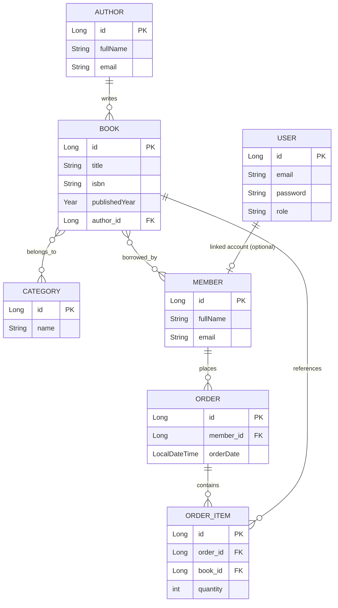

# Library Management API

A CRUD REST API for a library management system, built with a layered architecture as part of a scholarship program (DevJoint).

## Tech Stack

- Java 21
- Spring Boot 4
- Spring Data JPA / Hibernate
- MySQL
- Maven
- Lombok
- Bean Validation (Jakarta Validation)
- Spring Security + JWT (jjwt)
- Spring Cache, Spring Scheduling, Spring Async
- springdoc-openapi (Swagger UI)
- JUnit 5 + Mockito

## Architecture

The project follows a classic layered architecture:

```
Controller → Service → Repository
```

- **Entity** — JPA-mapped domain models
- **DTO** — request/response objects; entities are never exposed directly through the API
- **Repository** — Spring Data JPA interfaces, JPQL/derived queries, Specification API for dynamic filtering
- **Service** — business logic, exposed through interfaces with `Impl` implementations
- **Controller** — REST endpoints

## ER Diagram



**Relationships:**
- **Author → Book**: One-to-Many
- **Book ↔ Category**: Many-to-Many (join table: `book_category`)
- **Book ↔ Member**: Many-to-Many (borrowing)
- **Member → Order**: One-to-Many
- **Order → OrderItem**: One-to-Many
- **OrderItem → Book**: Many-to-One
- **User**: separate authentication entity (email, hashed password, role — USER/ADMIN)

## Features

### Core CRUD
- Full CRUD for Author, Book, and Member
- DTO-based request/response separation with validation (`@NotBlank`, `@Email`, `@Size`, `@NotNull`)
- Centralized exception handling (`@RestControllerAdvice`) with proper HTTP status codes
- Pagination and sorting on list endpoints
- Interactive API documentation via Swagger UI
- Unit tests for the service layer (Mockito)

### Authentication & Authorization
- JWT-based registration and login
- Passwords hashed with BCrypt
- Stateless Spring Security filter chain with a custom JWT filter
- Role-based access control (USER / ADMIN)
- Structured 401/403 JSON error responses, with a distinct message for expired tokens

### Database Relations & Advanced Queries
- Order → OrderItem (One-to-Many), Book ↔ Category (Many-to-Many)
- JPQL and derived query methods for complex filters
- Dynamic filtering endpoint using the Specification API
- `@Transactional` order creation with rollback on failure, verified by an integration test
- N+1 query problem detected and fixed with `@EntityGraph`

### Performance & Production Readiness
- Caching (Spring Cache) on read-heavy endpoints, with correct cache eviction on writes
- File upload/download endpoints for book covers (type & size validated)
- Scheduled daily cleanup task (`@Scheduled`)
- Async order confirmation notification (`@Async`)
- Externalized configuration (YAML, dev/prod profiles, secrets via environment variables)

## Getting Started

### Prerequisites

- Java 21+
- Maven
- MySQL running locally

### Configuration

The project uses YAML configuration with profiles:

- `application.yml` — shared settings
- `application-dev.yml` — local development (MySQL connection, debug logging)
- `application-prod.yml` — production (reads DB credentials from environment variables)

Set the active profile and JWT secret as environment variables / VM options, e.g.:

```
-Dspring.profiles.active=dev
JWT_SECRET=your-generated-secret
```

### Run

```bash
mvn spring-boot:run
```

The API will be available at `http://localhost:8080`.

### API Documentation

Swagger UI: `http://localhost:8080/swagger-ui/index.html`

## Running Tests

```bash
mvn test
```

Includes unit tests (Mockito) for the service layer and an integration test verifying transactional rollback on order creation.
